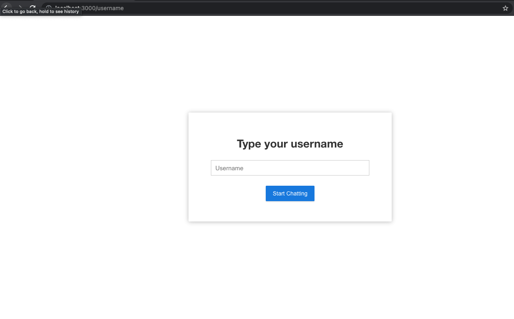
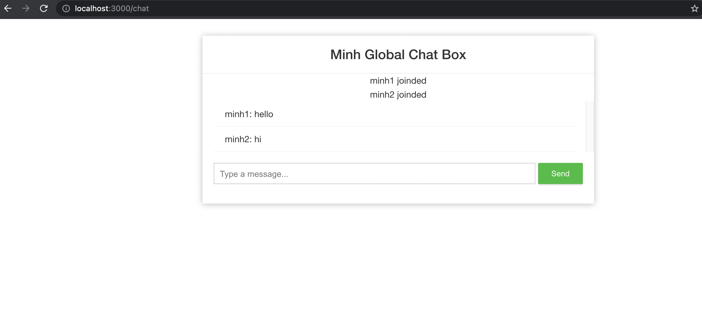

# ChatApplication with Springboot, Reactjs

Application used for chat among many people using websocket

---

## Technology:
1. Springboot, JavaWebsocket: Used to create server websocket
2. Reactjs: Used to create client connect to websocket server

---

## Core Function:
1. Input username to chatroom:

2. Chat with others:
